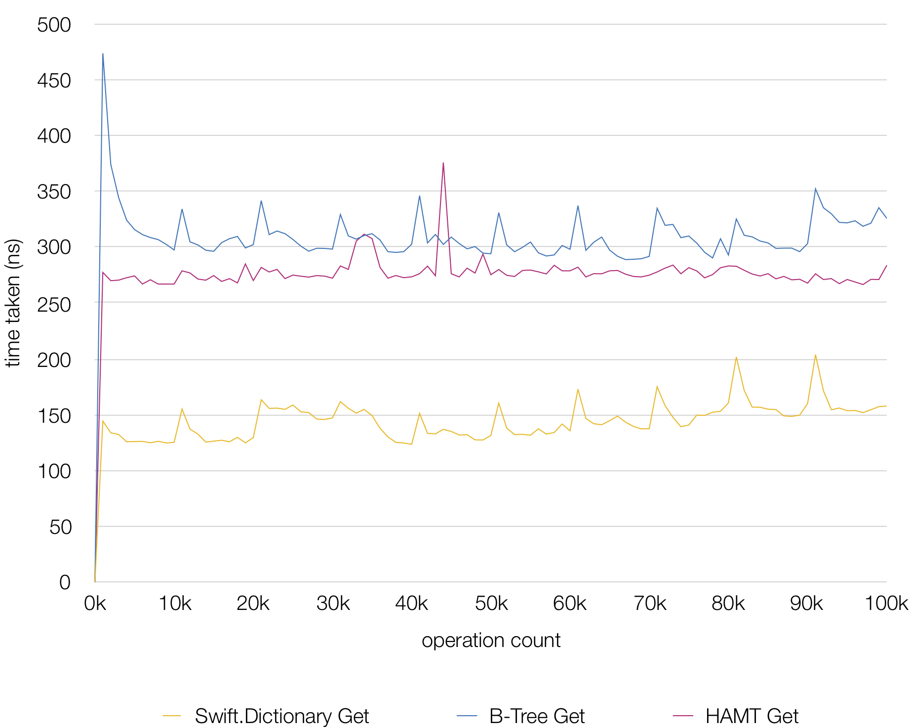
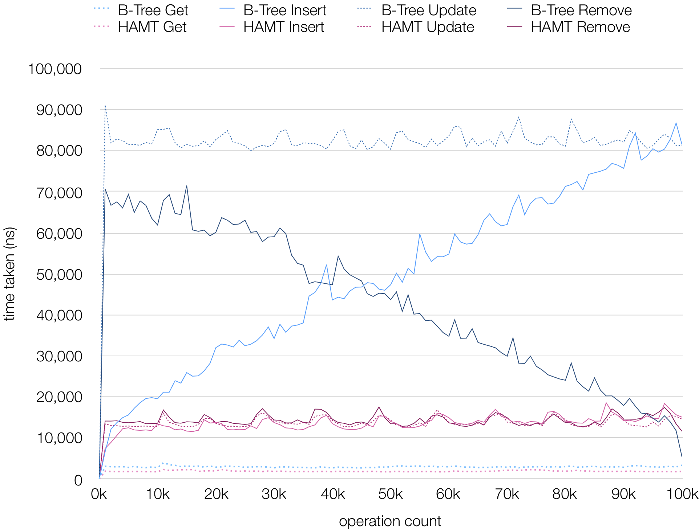

HAMT (for Swift)
=============
An implementation of [*HAMT(Hash Array Mapped Trie, Bagwell)*](https://en.wikipedia.org/wiki/Hash_array_mapped_trie) in Swift.
Eonil, May 2019.

Getting Started
------------------
Use `HAMT` type. This type implements these typical dictionary-like features.

- Conformance to `Sequence` protocol.
- Conformance to `Equatable` protocol.
- `isEmpty: Bool`
- `count: Int`
- `subscript(Key) -> Value? { get set }`
- `subscript(Key, default: @autoclosure () -> Value) -> Value { get set }`
- `keys: Sequence`
- `values: Sequence`

These features are not supported (maybe yet).

- `Index` and index based look-up and iteration.
- Any other collection protocol conformance.

Performance
----------------
`HAMT` is designed to be used as
[*persistent datastructure*](https://en.wikipedia.org/wiki/Persistent_data_structure).

`HAMT` provides near constant time (`O(10)`) single element read/write performance up to 
hash resolution limit (`(2^6)^10` items) for read/write/copy regardless of item count
where copying `Swift.Dictionary` takes linearly increased time.

Base read performance of `HAMT` is about 10x times slower than ephemeral
`Swift.Dictionary` with random 64-bit integer keys and values.
These numbers are measured for single element operations.

Here's another performance comparison with copying B-Tree. 
Naive copying of `Swift.Dictionary` is not drawn here because it takes too much time 
and couldn't finish the benchmark.

For small dataset, naive copying of `Swift.Dictionary` works better, but as 
copying cost increases linearly, it is no longer efficient after 1,000-5,000 items. 

Therefore, `HAMT` is better if you need a persistent hash-based associative array
data structure that can grow more than several thousands.

Maintenance
---------------
`HAMT` type is implemented using `PD5Bucket64` internally.
`PD5Bucket64` type provides all additional properties for testing and
validation.
`PD4` type was an implementation of hash-trie, and deprecated due to
high rate of wasted memory. `PD5` implements HAMT and shows nearly
same performance with `PD4` with far less memory consumption.

I used `PD5` prefix for convenience only for internals. Public major type 
name is `HAMT`, and internal types all use `PD5` prefixed. If I implement
a next version of algorithm, it'll be named as `PD6`.

If once implementation gets stabilized, maybe I'll rename all `PDx` prefixes
to `HAMT` someday.

Caution!
----------
If you link this library, you'll notice the performance is not good as shown 
in the graph. [As like Károly Lőrentey clarified](https://github.com/attaswift/BTree#generics),
it's because Swift compiler does not inline and optimize over externally 
linked functions.
You can compile HAMT source code with your code together in same 
module to archive best possible performance.

Laundry List
----------------
For now, this `HAMT` is far slower than `Swift.Dictionary` on read.
I think this is mainly because of cache misses due to bad data locality.
I think this can be better by employing object-pooling technique 
with `jemalloc`-like regular space allocation. I don't have much
specific ideas on this yet.

Though persistent data-structures are used to build a timeline,
it's impossible to keep infinite number of versions. Therefore most 
apps keep only certain number of snapshots, and this means 
there's usually a limit in dataset size. If there's a limit, having an
object-pool can provide some level of data locality in most
scenarios.

Credits
---------
- See also ["B-Tree for Swift" by Károly Lőrentey](https://github.com/attaswift/BTree) 
if you need sorted associative array.

- Here's a [nice explanation of how HAMT works by Marek](https://idea.popcount.org/2012-07-25-introduction-to-hamt/).

- For more information about HAMT, see
[the paper by Phil Bagwell](https://infoscience.epfl.ch/record/64398/files/idealhashtrees.pdf).

Contribution
---------------
Sending contribution means implicit agreement to redistribute
your contribution under "MIT License".

License
----------
This code is licensed under "MIT License".
Copyright Eonil, Hoon H.. 2019.
All rights reserved.
