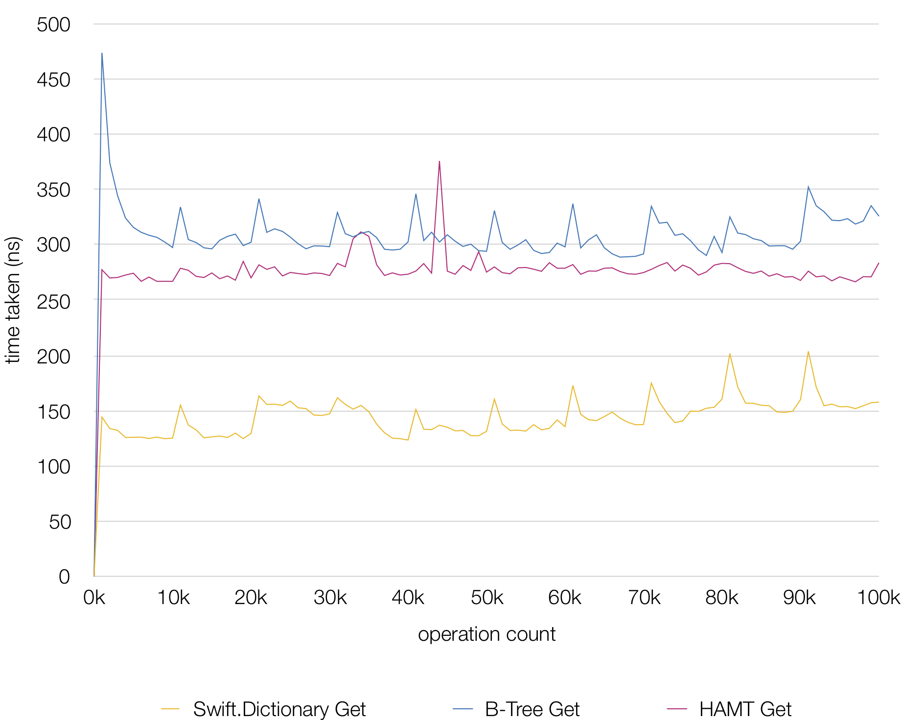
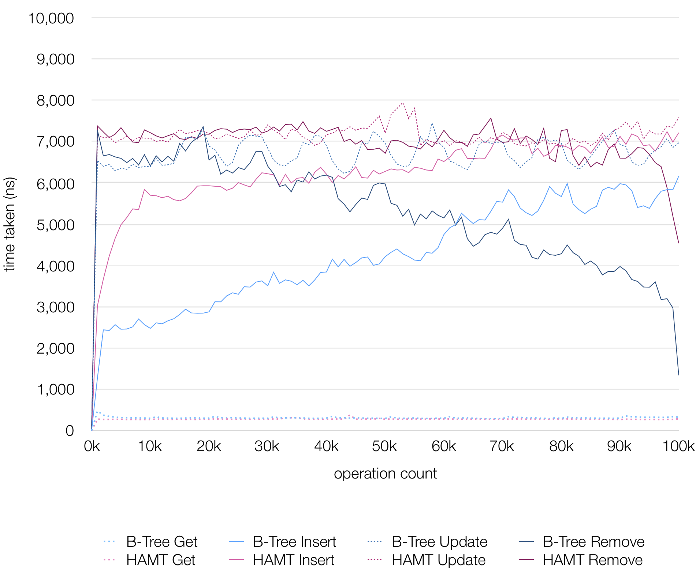

HAMT (for Swift)
=============
An implementation of [*HAMT(Hash Array Mapped Trie, Bagwell)*](https://en.wikipedia.org/wiki/Hash_array_mapped_trie) in Swift.
Eonil, May 2019.

Getting Started
------------------
Use `HAMT` type. This type provides these features.

- Hash-based key-value storage.
- All of read/write/copy `amortized O(log(n))` time up to certain number of elements
  (see [Performance](#Performance) section), and `O(n)` at worst.
- Full ["Copy-on-Write"](https://en.wikipedia.org/wiki/Copy-on-write) behavior 
  with minimal amount of copying.

The type provides these dictionary-like interfaces.
   
- Conformance to `Sequence` protocol.
- Conformance to `Equatable` protocol.
- `isEmpty: Bool`
- `count: Int`
- `subscript(Key) -> Value? { get set }`
- `subscript(Key, default: @autoclosure () -> Value) -> Value { get set }`
- `keys: Sequence`
- `values: Sequence`

These features are not supported (maybe yet).

- `Index` and index based look-up and iteration.
- Any other collection protocol conformance.

Copy-on-Write Persistence
---------------------------------------------
As like most Swift datastrctures, `HAMT` is also fully CoW compliant. This means 
each copy of same HAMT tree shares data as much as much possible. Regardles 
of how many copies you make, HAMT shares most portion of tree with all other
copies.

Performance
----------------
`HAMT` type in this library is designed to be used as
[*persistent datastructure*](https://en.wikipedia.org/wiki/Persistent_data_structure).

In copy-persistent scenario under 64-bit environment, 
`HAMT` provides near constant time (`O(log(n)) & max depth=10, -> O(10)`) single element read/write/copy
performance up to hash resolution limit (`(2^6)^10` items) regardless of contained item 
count if hash function is well distributed. Also new copy does not take extra space unless
gets mutated. Copy with single element mutation takes `O(log(n))` extra time and space.
On the other hand, copying `Swift.Dictionary` takes `O(n)` time and extra space. 

Instead, single element read/write of `HAMT` is about 2x/50x times slower
than ephemeral `Swift.Dictionary` for random 64-bit integer keys and values.

Note that "operation count" in above graph is accumulated number.

Here's another performance comparison with copying B-Tree. 
Naive `Swift.Dictionary` is not drawn here because read/write performance 
is same with ephemeral one, and copying it takes too much time and didn't finish.

For small dataset, naive copying of `Swift.Dictionary` works better, but as 
copying cost increases linearly, it is no longer efficient after 1,000 items.

Therefore, `HAMT` is better if you need a hash-based persistent associative array
data structure that can grow more than several thousands.

B-Tree shows better write performance overall. HAMT performs better after 100K 
items, but it doesn't seem to be really practical numbers. And it requires keys
to be `Comparable`. By the way, as B-Tree doesn't have hash collision, it'll show
more reliable performance.

Maintenance
---------------
`HAMT` type is implemented using `PD5Bucket64` internally.
`PD5Bucket64` type provides all additional properties for testing and
validation.
`PD4` type was an implementation of hash-trie, and deprecated due to
high rate of wasted memory. `PD5` implements HAMT and shows nearly
same performance with `PD4` with far less memory consumption.

I used `PD5` prefix for convenience only for internals. Public major type 
name is `HAMT`, and internal types all use `PD5` prefixed. If I implement
a next version of algorithm, it'll be named as `PD6`.

If once implementation gets stabilized, maybe I'll rename all `PDx` prefixes
to `HAMT` someday.

At this point, only 64-bit platforms are considered. It should work on
32-bit platforms but less performance and have not been tested.

Caution!
----------
If you link this library, you'll notice the performance is not good as shown 
in the graph. [As like Károly Lőrentey clarified](https://github.com/attaswift/BTree#generics),
it's because Swift compiler does not inline and optimize over externally 
linked functions.
You can compile HAMT source code with your code together in same 
module to archive best possible performance.

Credits
---------
- See also ["B-Tree for Swift" by Károly Lőrentey](https://github.com/attaswift/BTree) 
if you need sorted associative array.

- Here's a [nice explanation of how HAMT works by Marek](https://idea.popcount.org/2012-07-25-introduction-to-hamt/).

- For more information about HAMT, see
[the paper by Phil Bagwell](https://infoscience.epfl.ch/record/64398/files/idealhashtrees.pdf).

Contribution
---------------
Sending contribution means implicit agreement to redistribute
your contribution under "MIT License".

License
----------
This code is licensed under "MIT License".
Copyright Eonil, Hoon H.. 2019.
All rights reserved.
